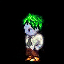
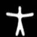
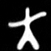
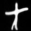

## Implementation of "Longitudinal Latent Diffusion Models"


<p align="center">
    <a>
	    
	</a>
    <a>
	    
	</a>
    <a>
	    
	</a>
     <a>
	    
	</a>
    <a>
	    
	</a>
    <a>
	    
    </a>
</p>
<p align="center">
  <b>Generated sequences</b>
</p>
	

**Disclaimer**: 
- The code in `lib` is an adaptation from [1]. In particular, we added there the LLDM implementation in `lib/src/models/lldm`.
- The code in `lib` is an adaptation from `https://github.com/clementchadebec/geometric_perspective_on_vaes`

[1] Chadebec, C., Vincent, L. J., and Allassonni `ere, S. Pythae:
Unifying generative autoencoders in python–a bench-
marking use case. Proceedings of the Neural Information
Processing Systems Track on Datasets and Benchmarks,
2022


## Setup

Create an environment, activate it and install dependencies:

```bash
python -m venv lldm_env
source lldm_env/bin/activate
pip install -r requirements.txt
```

All the notebooks in the folder `notebooks` experiments-xxx.ipynb are then directly runnable and replicate the figures/tables of the paper.
If anything wrong, please feel free to reach out.
